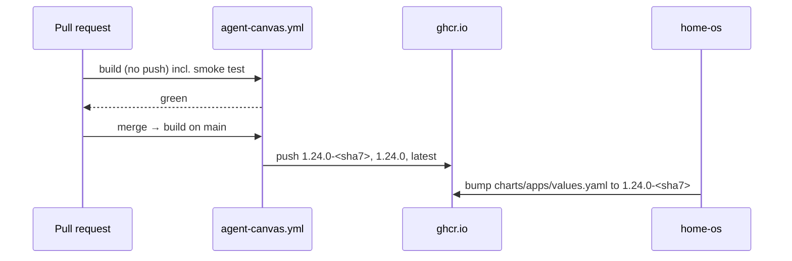

# Agent guide — another-agentic-images

`AGENTS.md` is a symlink to this file. Edit `CLAUDE.md` only.

## What this is

Container images for the another-agentic family and for self-hosting OpenHands
Agent Canvas, with toolchains baked in. Renamed from `vymalo/openhand-images`
on 2026-09-28.

| Image | Source | Consumed by |
|---|---|---|
| `ghcr.io/vymalo/another-agentic-images/agent-canvas` | `agent-canvas/Dockerfile` | `WhyThatFunction/home-os`, `charts/apps/values.yaml`, Application `agent-canvas` (netcup) |

It is upstream `ghcr.io/openhands/agent-canvas` (pinned by tag **and** digest)
plus Rust, Flutter/Dart, corepack, sccache, and the Claude Code, Codex and
OpenCode CLIs.

## Layout contract — every change must keep these true

1. **Toolchains live under `/opt`, never under `$HOME`.** The deployment mounts
   persistent volumes over parts of `/home/openhands`, and a mount hides what
   the image put there.
2. **Pre-create the parents of nested mount points as `openhands`.** A container
   runtime creates missing parents of a mount target as root (e.g. mounting
   `~/.local/share/opencode` would leave `~/.local/share` root-owned).
3. **`PATH` and tool env go in `/etc/profile.d/10-toolchains.sh` as well as
   `ENV`.** Debian's `/etc/profile` resets `PATH` for login shells, and agent
   terminals are login shells.
4. **Configure each tool in its own config file,** not via `npm_config_*` env
   vars (npm reads them all and warns). Test the versions projects actually pin
   (pnpm 10 and 12 read different files).
5. **Global npm installs keep their postinstall scripts** (Claude Code and
   OpenCode select native binaries there) and **self-updaters are off**
   (`DISABLE_AUTOUPDATER`, `OPENCODE_DISABLE_AUTOUPDATE`); versions move only
   through `ARG`s.
6. **Don't reinstall what upstream ships** (the ACP adapters in `/acp-node`).
7. **The last `RUN` is the smoke test**, in a login shell as uid 10001. Every
   added tool gets a line there.

Skill: `change-image` (`.agents/skills/change-image/SKILL.md`).

## Release flow



- **Don't merge before the PR's own build is green** — the smoke test is the
  only proof the tools work as the runtime user.
- Deployments pin the immutable `<agent-canvas version>-<sha7>` tag.
- A new package path must be checked for **anonymous pull** before a
  deployment points at it:

```sh
TOKEN=$(curl -s "https://ghcr.io/token?scope=repository:vymalo/another-agentic-images/agent-canvas:pull" | python3 -c 'import sys,json;print(json.load(sys.stdin)["token"])')
curl -s -o /dev/null -w '%{http_code}\n' -H "Authorization: Bearer $TOKEN" \
  -H 'Accept: application/vnd.oci.image.index.v1+json, application/vnd.oci.image.manifest.v1+json, application/vnd.docker.distribution.manifest.v2+json' \
  https://ghcr.io/v2/vymalo/another-agentic-images/agent-canvas/manifests/<tag>
```

## Commands

```sh
docker buildx build --check --platform linux/amd64 -f agent-canvas/Dockerfile agent-canvas   # lint
git config core.hooksPath .githooks                                                          # once per clone
```

## Commits

Conventional Commits, enforced by `tools/commit-lint.sh` (local hook and CI).

## Pull requests

- Branch + PR against `main`; `gh`/`git push` via `zsh -i -c '…'`.
- Body follows `.github/PULL_REQUEST_TEMPLATE.md` (AI governance; the
  `AI Governance` check enforces it).
- Checks: `AI Governance`, `Commit Lint`, and `Build agent-canvas` when the image changes.
